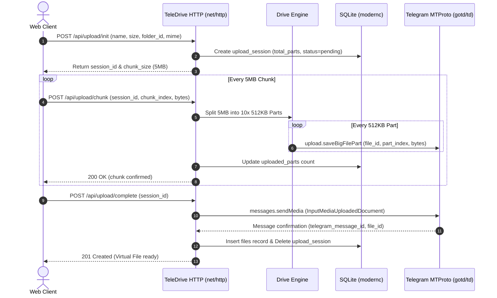
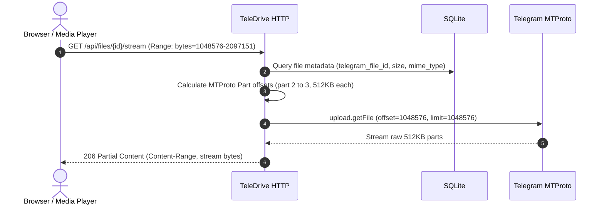
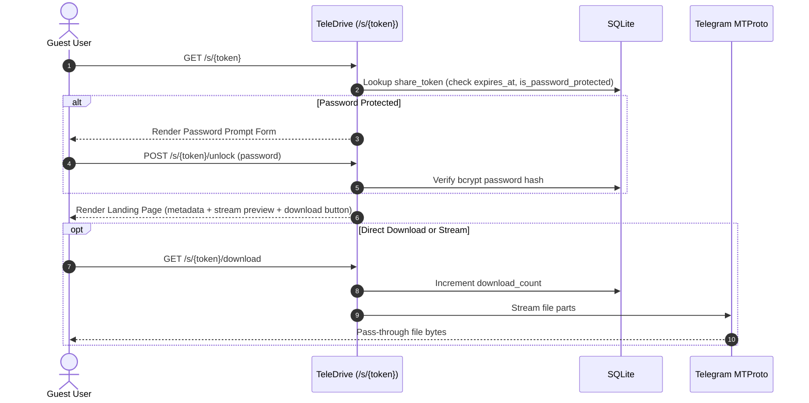
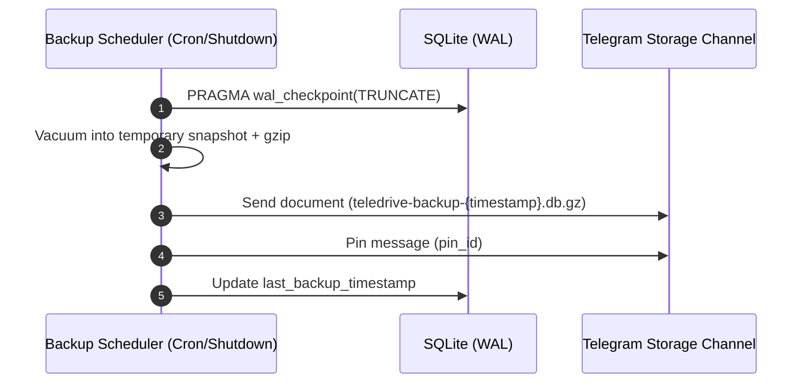

# TeleDrive Architecture

TeleDrive is a single-binary cloud storage system that bridges a web interface and virtual file system to Telegram's distributed cloud infrastructure via MTProto.

---

## 1. System Overview

```
+---------------------------------------------------------------------------------+
|                                TeleDrive Host                                   |
|                                                                                 |
|  +--------------------------+   +-------------------------+   +-------------------+  |
|  |     Web UI (Browser)     |   |   Embedded Dashboard    |   |     CLI Tool      |  |
|  | (HTML5/Vanilla/CSS/SVG)  |<->| (net/http + templates)  |<->| (teledrive login) |  |
|  +--------------------------+   +-------------------------+   +-------------------+  |
|                                         |                                       |
|                                         v                                       |
|                        +---------------------------------+                      |
|                        |       Drive Core Engine         |                      |
|                        | - Virtual Folder Tree           |                      |
|                        | - Resumable Upload Coordinator  |                      |
|                        | - Range Request Streamer        |                      |
|                        | - Share Link Authorizer         |                      |
|                        +---------------------------------+                      |
|                               |                   |                             |
|                               v                   v                             |
|                  +----------------------+  +---------------------+              |
|                  | SQLite Metadata (WAL)|  | Telegram MTProto    |              |
|                  | - modernc.org/sqlite |  | - gotd/td client    |              |
|                  | - AES-GCM Sessions   |  | - 512KB Part Worker |              |
|                  +----------------------+  +---------------------+              |
+-------------------------------------------------------|-------------------------+
                                                        | MTProto TCP/TLS
                                                        v
                                          +---------------------------+
                                          | Telegram Cloud Platform   |
                                          | (Storage Channel Vault)   |
                                          +---------------------------+
```

---

## 2. Core Workflows

### 2.1 Resumable Upload Flow

The client browser slices large files into 5 MB–10 MB **Chunks**. TeleDrive receives each chunk, slices it into 512 KB MTProto **Parts**, streams them directly to Telegram via `gotd/td`, and tracks the upload session in SQLite.



---

### 2.2 Download & Media Streaming Flow (HTTP 206 Range)

To preview videos or resume partial downloads, TeleDrive translates HTTP byte-range requests directly into MTProto part offsets without buffering the entire file.



---

### 2.3 Share Link Flow

Public visitors access files via cryptographic tokens. Passwords and expiry are validated at the edge before streaming bytes.



---

### 2.4 Disaster Recovery & Backup Flow

The SQLite database is backed up to the dedicated Storage Channel periodically and on shutdown.



---

## 3. Database Schema (SQLite)

```sql
-- Virtual Folder hierarchy
CREATE TABLE folders (
    id TEXT PRIMARY KEY,
    parent_id TEXT NULL REFERENCES folders(id) ON DELETE CASCADE,
    name TEXT NOT NULL,
    created_at DATETIME DEFAULT CURRENT_TIMESTAMP,
    updated_at DATETIME DEFAULT CURRENT_TIMESTAMP
);
CREATE INDEX idx_folders_parent ON folders(parent_id);

-- Virtual Files mapped to Telegram objects
CREATE TABLE files (
    id TEXT PRIMARY KEY,
    folder_id TEXT NULL REFERENCES folders(id) ON DELETE SET NULL,
    name TEXT NOT NULL,
    size INTEGER NOT NULL,
    mime_type TEXT NOT NULL,
    telegram_message_id INTEGER NOT NULL,
    telegram_file_id TEXT NOT NULL,
    telegram_access_hash TEXT NOT NULL,
    sha256 TEXT,
    created_at DATETIME DEFAULT CURRENT_TIMESTAMP,
    updated_at DATETIME DEFAULT CURRENT_TIMESTAMP
);
CREATE INDEX idx_files_folder ON files(folder_id);
CREATE INDEX idx_files_name ON files(name);

-- In-flight resumable upload sessions
CREATE TABLE upload_sessions (
    id TEXT PRIMARY KEY,
    folder_id TEXT REFERENCES folders(id),
    name TEXT NOT NULL,
    size INTEGER NOT NULL,
    mime_type TEXT NOT NULL,
    total_parts INTEGER NOT NULL,
    uploaded_parts INTEGER DEFAULT 0,
    telegram_file_id INTEGER NOT NULL, -- gotd random ID
    created_at DATETIME DEFAULT CURRENT_TIMESTAMP
);

-- Public share links
CREATE TABLE share_links (
    id TEXT PRIMARY KEY,
    token TEXT UNIQUE NOT NULL,
    file_id TEXT NOT NULL REFERENCES files(id) ON DELETE CASCADE,
    password_hash TEXT NULL,
    expires_at DATETIME NULL,
    download_count INTEGER DEFAULT 0,
    max_downloads INTEGER NULL,
    created_at DATETIME DEFAULT CURRENT_TIMESTAMP
);
CREATE INDEX idx_share_token ON share_links(token);

-- Encrypted Telegram MTProto session & system settings
CREATE TABLE settings (
    key TEXT PRIMARY KEY,
    value TEXT NOT NULL,
    updated_at DATETIME DEFAULT CURRENT_TIMESTAMP
);
```

---

## 4. Source Directory Structure

Following the Ponytail principle (minimal files, zero unnecessary abstractions):

```
teledrive/
├── CONTEXT.md
├── ARCHITECTURE.md
├── SECURITY.md
├── MILESTONES.md
├── docs/adr/
│   ├── 0001-storage-channel-target.md
│   ├── 0002-pure-go-mtproto-client.md
│   ├── 0003-pass-through-streaming.md
│   ├── 0004-modernc-sqlite-pure-go.md
│   ├── 0005-stdlib-net-http.md
│   ├── 0006-chunked-resumable-http-upload.md
│   ├── 0007-aes-gcm-session-encryption.md
│   ├── 0008-primary-account-tos-safe-mode.md
│   └── 0009-zero-build-embedded-modern-ui.md
├── cmd/
│   └── teledrive/
│       └── main.go              # CLI router (server, login, upload, list, backup)
├── internal/
│   ├── app/
│   │   └── config.go            # Minimal configuration loader
│   ├── crypto/
│   │   └── aes.go               # AES-256-GCM encryption helpers
│   ├── db/
│   │   ├── db.go                # SQLite init (WAL mode)
│   │   ├── files.go             # Virtual folder & file CRUD
│   │   └── backup.go            # Snapshot export & restore
│   ├── telegram/
│   │   ├── client.go            # gotd/td connection manager
│   │   ├── auth.go              # CLI interactive login wizard
│   │   ├── uploader.go          # 512KB MTProto part uploader
│   │   ├── downloader.go        # Range-aware MTProto part streamer
│   │   └── limiter.go           # FloodWait backoff & rate queue
│   └── web/
│       ├── server.go            # net/http ServeMux routes & middleware
│       ├── handlers_drive.go    # File/folder operations & uploads
│       ├── handlers_share.go    # Public /s/{token} & /api/shares management
│       └── static/              # Embedded UI assets (CSS design tokens, Lucide SVG, Vanilla JS)
├── go.mod
└── go.sum
```
